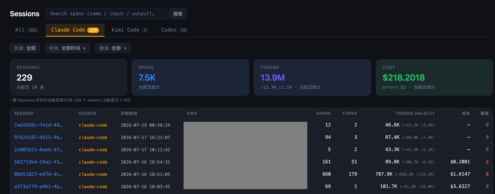
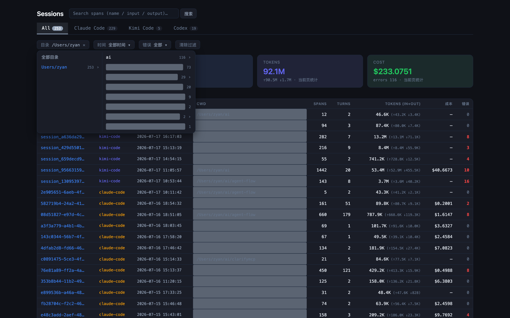
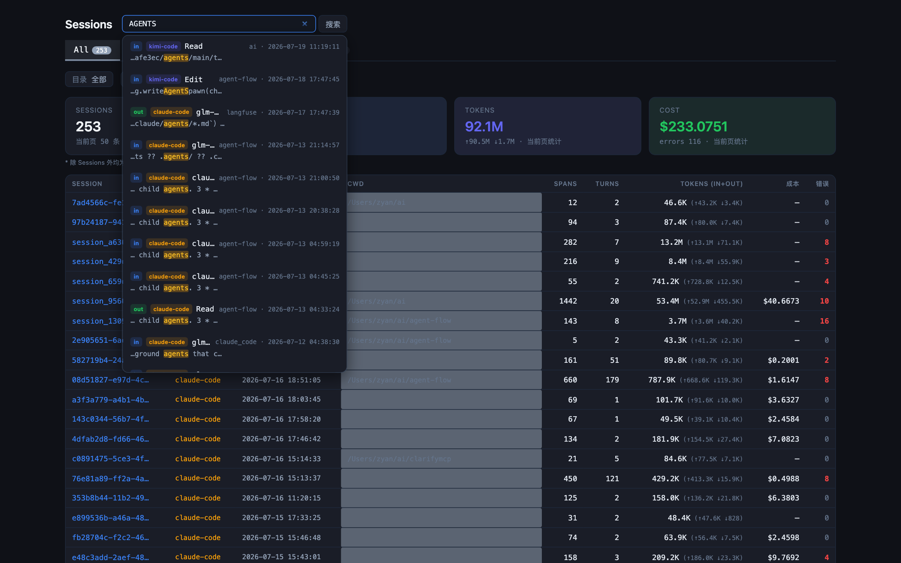
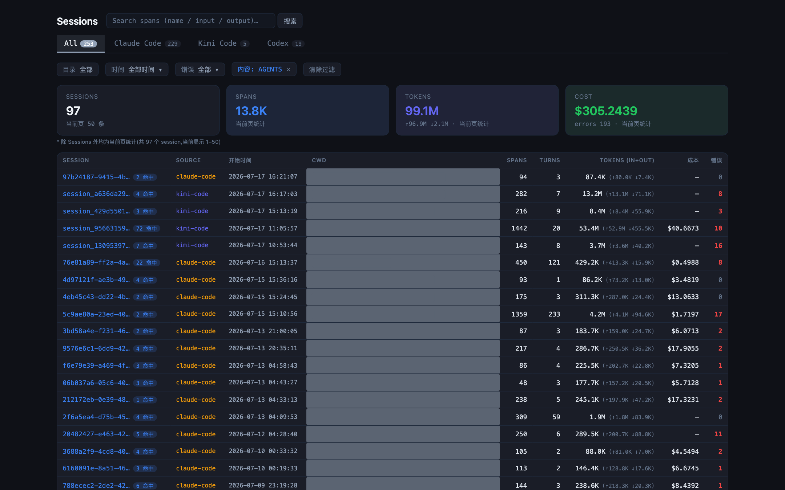
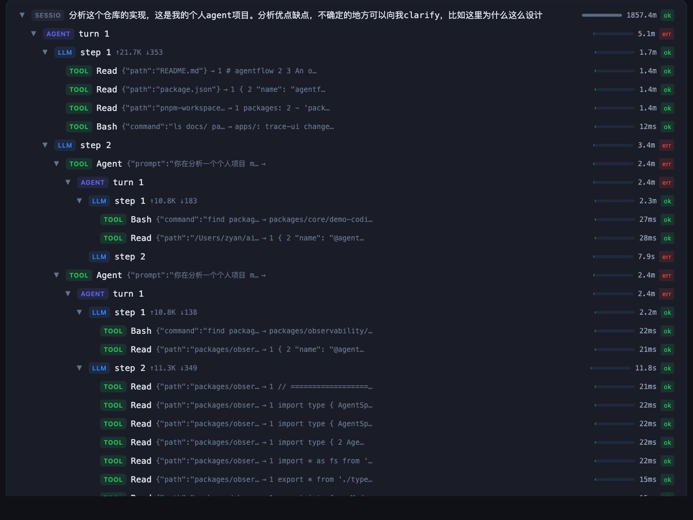
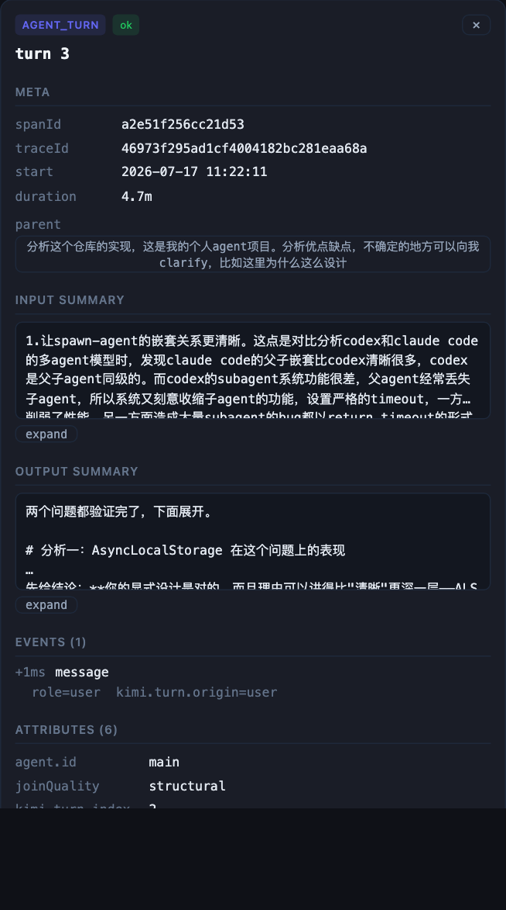

# trace-your-agent (`tya`)

**把你的 AI agent 会话变成一棵可点的 span 树。** 读取 Claude Code / Codex / Kimi Code 在你本机产生的会话记录，统一成 span 树，本地终端 + 本地 Web UI 查看。数据不出本机。

[](LICENSE)
[](package.json)

## 功能一览

**会话总览** — 按平台过滤（Claude Code / Kimi Code / Codex)，每会话聚合 span/turn/token/成本/错误：



**目录级联过滤** — 除会话级聚合外，还支持业务仓库（cwd）级聚合：多级展开、每级带计数；另有时间范围与错误三态：



**全文搜索** — 输入即出命中：`in/out` 命中字段徽章、平台徽章、关键词高亮、项目名，点击直达该 span:



**会话级过滤** — 回车后表格只留含命中的会话，每行标"N 命中"；过滤状态全量同步 URL，分享/返回不丢：



**span 树详情** — turn 展开即每步模型调用（LLM）与工具执行（TOOL)，子代理（Agent）下嵌套子树：



点击任意节点，看完整的输入/输出/耗时/属性/事件；后台子代理 ⏚、中断 ⚠、启发式挂载虚线框：



更多细节：父子挂载按证据强度标 `structural / semi / heuristic`，挂不上就是孤儿，绝不编造；中断会话标 `incomplete`;LLM 时长为推算值时标 `approx`。

## 30 秒上手

要求 Node.js ≥ 20，无需安装：

```bash
npx trace-your-agent doctor     # ① 体检:看看你机器上有哪些 agent 数据
npx trace-your-agent ingest     # ② 采集:会话文件 → span 树(增量,可反复跑)
npx trace-your-agent serve      # ③ 打开本地 Web UI → http://127.0.0.1:4777
```

不想开浏览器？终端里也能看：

```bash
npx trace-your-agent sessions                       # 列出所有会话
npx trace-your-agent show <sessionId>               # ASCII span 树
npx trace-your-agent export <sessionId> --format html   # 导出单文件 HTML,发给同事就能看
```

从源码运行：`git clone` 后 `npm install && npm run build`，然后 `npx tya --help`。

## 支持的平台

| 平台 | 数据源（严格只读） | LLM 时长精度 |
| --- | --- | --- |
| Claude Code | `~/.claude` 会话记录 | ≈ 推算（标记 `approx`) |
| Codex | `~/.codex` rollout 记录 | ≈ 推算（标记 `approx`) |
| Kimi Code(v1 + v2) | `~/.kimi-code` wire 记录 | ✅ 精确（首 token/流式/解码细分） |

## 命令速查

| 命令 | 作用 |
| --- | --- |
| `tya doctor` | 探测三个 agent 的家目录（版本/可读性/文件数） |
| `tya ingest [--source cc\|codex\|kimi]` | 采集（增量、幂等） |
| `tya sessions [--source ...]` | 列出会话（含 token/成本/错误） |
| `tya show <id>` | 终端 ASCII span 树 |
| `tya export <id> [--format ndjson\|html]` | 导出（HTML 自包含、已脱敏、可直接分享） |
| `tya serve [--port n] [--no-open]` | 本地 Web UI([API 契约](docs/api.md)) |
| `tya prune --older <days>` | 清理过期 payload |
| `tya install-hooks claude-code` | （可选）安装 CC hook，把子代理 join 从"推断"升级为"精确"；写入前自动备份，`uninstall-hooks` 无残留移除 |

数据只写入 `~/.trace-your-agent/`（环境变量 `TYA_HOME` 可覆盖）。

## 隐私

1. **纯本地、零遥测**，不联网。
2. **对 agent 家目录严格只读**（唯一例外：显式 `install-hooks`，且先备份）。
3. **密钥脱敏默认开启**:`sk-ant-*`、`ghp_*`、`AKIA*`、`Bearer` 等一律 `[REDACTED]` 后才落盘。
4. HTML 导出**不含 payload 全文**，只有脱敏后的摘要——你看到的即接收者能看到的。

## 已知限制（摘要）

- CC / Codex 的 LLM 调用时长是推算值（源文件不记 API 边界）;kimi 的 `llm.request` 不含完整请求/响应 body
- 父子关系靠三级证据降级匹配，`heuristic` 级可能挂错——UI 会如实标注
- 详细说明：[docs/limitations.md](docs/limitations.md) · kimi 格式细节：[src/adapters/kimi-code/FORMAT.md](src/adapters/kimi-code/FORMAT.md)

## 开发

```bash
npm install && npm run build   # tsup(CLI) + vite build(UI)
npm test                       # vitest,166 个测试
npm run typecheck              # tsc strict
```

加新适配器：实现 [src/core/source.ts](src/core/source.ts) 的 `Adapter` 契约（`detect` / `discover` / `parse`)，在 `src/adapters/registry.ts` 注册。

更新 README 截图：`TYA_HOME=<数据目录> npx tya serve --no-open` 后跑 `node scripts/screenshot.mjs`（本机 Chrome + puppeteer-core)。

## Roadmap

- `ingest --follow` 实时尾随 · 泳道视图（按 agent 分道） · OTLP 导出 · Codex rollout-trace bundle · 代理模式

## License

MIT
